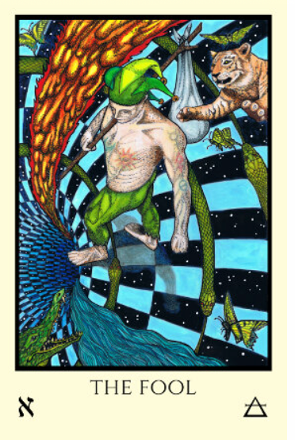

              

esteganografia
                                           

REFERENTES

  

<a href="https://wiki.ead.pucv.cl/images/archive/7/70/20111011141115%21Construir_habitar_pensar_heidegger.pdf">
Martin Heidegger - Construir, Habitar, Pensar

  

<a href="https://github.com/Guerrillaradio/buanproject">
Proyecto Buan - Multi layer complex Project

  
</a>
